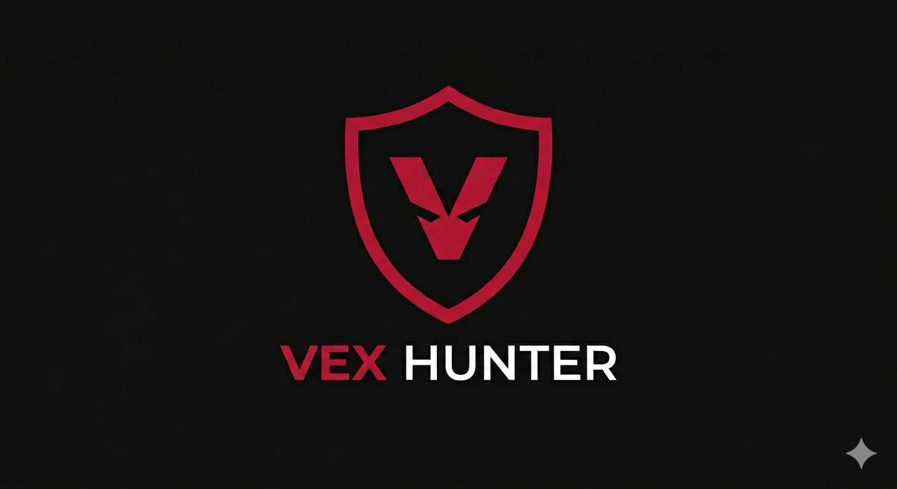

 

# Full-Stack Software Engineer & Cybersecurity Researcher

---

---

## Executive Summary

I am a results-driven Full-Stack Developer dedicated to engineering robust, scalable, and highly secure digital solutions. My expertise spans the entire software development lifecycle, specializing in architectures that seamlessly bridge intuitive user experiences with high-performance server logic. 

In tandem with core software engineering, I am deeply immersed in advanced cybersecurity methodologies. My focus centers on understanding infrastructural threat vectors, network architecture diagnostics, and secure coding practices. This intersection of full-stack engineering and defensive security allows me to architect applications with a security-first paradigm, mitigating vulnerabilities prior to deployment.

---

## Technical Core Competencies

### Frontend Development
* **Languages & Core:** HTML5, CSS3, JavaScript (ES6+)
* **Frameworks & Libraries:** React.js

### Backend Development & Databases
* **Server-Side Environments:** Node.js, Python
* **Web Frameworks:** Flask
* **Database Management:** SQL & NoSQL Architecture

### Cybersecurity & Infrastructure
* **Operating Systems:** Kali Linux
* **Network Auditing & Enumeration:** Nmap (Advanced Port Scanning & Firewall Evasion)

### DevOps & Tools
* **Version Control:** Git, GitHub

---

## Current Objectives & Research Interests

* Investigating offensive and defensive network security frameworks via simulated environments on the Hack The Box Academy platform.
* Implementation of secure development lifecycles (DevSecOps) to automate security auditing inside the continuous integration pipeline.
* Scalable infrastructure engineering utilizing modern containerization and serverless backends.

---

### Metrics & Contribution Diagnostics

 

  

